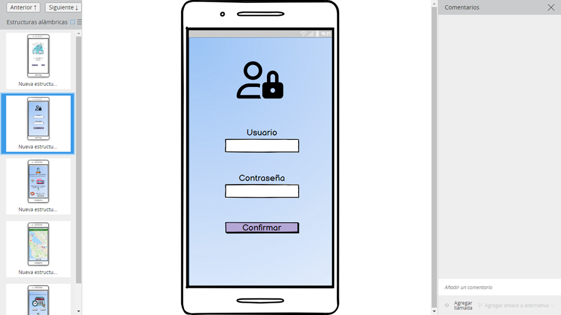

Diseño de interfaz de usuario:

El diseño de la interfaz de Route Plan, es un diseño que permite la identificación 
rápida de los diferentes aspectos funcionales.

El software utilizado es Balsamiq y los colores a utilizar están basados en combinación
de escalas de azul. A continuación se presentan las principales pantallas:

1. Ventana principal de ingreso al sistema:

   Cuando al usuario ingresa va a observar un logo de identificación de la aplicación y 
2. las dos opciones principales

2. Ingreso credenciales del usuario:

   En este paso el usuario va a digitar los datos de sus credenciales, nombre del usuario 
3. y la contraseña, para verificar los permisos.

3. Teniendo en cuenta los datos del usuario, el sistema presentará la información relacionada 
4. con la programación que inicia cada dia.

 

4. El usuario cofirma el itineracio, teniendo en cuenta el tiempo y distancia programadas en 
5. el recorrido.

   

5. Paleta de colores azul.

   
